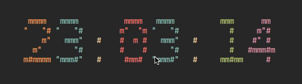

# Zak's Ztorg


This is My First Attempt to have something remotely big Project.

- A collection of mudules and libraries I wrote or put to-gether for just making anything.
- The Source Code is Made to be Independent. I'll release a more Refined Library which is not tied w/ ztorg In Future. But if You are fairly competent in programming. You can use my source and modify however you like.
- Can be used for both GUI and TUI implementation,


Main Source Layout
---
```sh
src
├── deps
├── extmod
├── programs
│   ├── demos_curses
│   ├── tools_curses
│   ├── tools_curses_new
│   ├── tools_tisk
│   └── ztorg
├── zse
│   ├── common
│   │   └── z_
│   │       ├── extra
│   │       ├── proc
│   │       └── types
│   ├── config
│   ├── entity
│   ├── io
│   │   ├── SDL
│   │   ├── curses
│   │   ├── opengl
│   │   │   └── glad
│   │   │       ├── KHR
│   │   │       └── glad
│   │   ├── tisk
│   │   └── vulkan
│   ├── logic
│   │   └── mte
│   ├── map
│   ├── map_old
│   ├── sprite
│   ├── sys
│   ├── tile
│   ├── tile_old
│   └── zse_all
└── zse_test
```
### Take-away
- `deps`: For External Dependencies; Not maintained within Ztorg or ZSE.
- `extmod`: External Modification Directly writen onto ZSE and Ztorg.
- `programs`: Tools and Demos created with OR for ZSE.
- `zse`: Main ZSE source directory.
    - `common`: Sources Used Everywhere.
    - `io`: Main Input/Output streamer.
    - `sprite`: Sprite Handler.
    - `map`: Map Handler.
    - `map_old`: [ **DEPRICATED** ] Old Map Submodule & Handler. Kept for refference.
    - `sys`: Module To Communicate with system, log and police the library itself
    - `tile`: Tileset Handler.
    - `tile_old`: **[ DEPRICATED ]** Tileset Handler.
    - `entity`: Entity Handler.
    - `logic`: Main Logic Handler and the mediator b/w `map`,`tile`,`entity` etc.

Read On [How to Install Ztorg?](INSTALL.md)


MORE DOCS INCOMMING!!!

## Examples

* **Clock with Ncurses (57 slocs)**


---
#### IF ANYONE READING THIS

If you wonder upon this repo and think my coding bollocks.
I'm Still a Novice so if you have ways for me to improve. By all regards hit me up.

Cheers !!!
